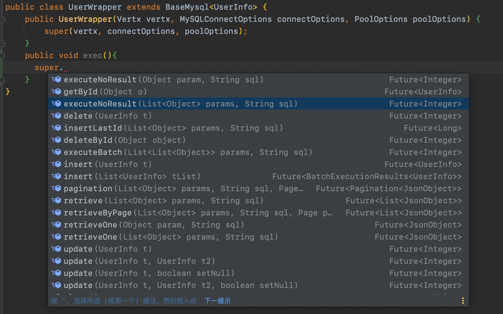

# vertx-reves-mysql
一个 vert.x 的自用框架 mysql 模块

## 说明
对`vertx-mysql-client` 进行进一步封装,vertx版本`4.0.0.CR1`.
通过自定义注解和反射生成sql,封装简单的增删改查和分页.

## 使用说明

### 实体注解说明
* `MySQLTableName` class 注解,表名 
* `MySQLId` field注解,主键字段
* `MySQLColumnName` field注解,属性对应数据库字段名
* `MySQLExclude` 例外字段,排除

通过反射+枚举生成查询语句,默认将字段名从驼峰命名转换为下划线小写命名对应到数据库.通过 `MySQLColumnName`  注解自定义字段对应.


### 查询工具类说明
`BaseMysql<T>` 基础查询类,实体操作直接继承此类,提供实体相关基础操作函数  
`MysqlWrapper` 数据库操作类,提供直接的mysql操作函数



#### 构造函数
查看 `MySQLConnectOptions connectOptions, PoolOptions poolOptions`
相关[文档](https://vertx.io/docs/vertx-mysql-client/java/#_configuration)

## 示例 

数据库表 `user_info`
```sql
CREATE TABLE `user_info` (
  `id` int NOT NULL AUTO_INCREMENT,
  `user_name` varchar(10) DEFAULT NULL,
  `user_age` int DEFAULT NULL,
  `create_time` datetime DEFAULT NULL,
  PRIMARY KEY (`id`)
) ENGINE=InnoDB DEFAULT CHARSET=utf8mb4 COLLATE=utf8mb4_0900_ai_ci;
```

实体类 `UserInfo`
```java
@MySQLTableName("user_info")
public class UserInfo {
	@MySQLId
	private Long id;
	@MySQLColumnName("user_name")
	private String userName;
	private Integer userAge;
	private LocalDateTime createTime;

	public Long getId() {
		return id;
	}

	public UserInfo setId(Long id) {
		this.id = id;
		return this;
	}

	public String getUserName() {
		return userName;
	}

	public UserInfo setUserName(String userName) {
		this.userName = userName;
		return this;
	}

	public Integer getUserAge() {
		return userAge;
	}

	public UserInfo setUserAge(Integer userAge) {
		this.userAge = userAge;
		return this;
	}

	public LocalDateTime getCreateTime() {
		return createTime;
	}

	public UserInfo setCreateTime(LocalDateTime createTime) {
		this.createTime = createTime;
		return this;
	}
}
```

实体操作类 `UserWrapper`
```java
public class UserWrapper extends BaseMysql<UserInfo> {
    public UserWrapper(Vertx vertx, MySQLConnectOptions connectOptions, PoolOptions poolOptions) {
        super(vertx, connectOptions, poolOptions);
    }
}
```


使用 

```java 
	public static void main(String[] args) {
		MySQLConnectOptions mySQLConnectOptions = new MySQLConnectOptions();
		mySQLConnectOptions
			.setHost("127.0.0.1")
			.setDatabase("test")
			.setUser("root")
			.setPassword("123456");
		UserWrapper userWrapper = new UserWrapper(Vertx.vertx(), mySQLConnectOptions, new PoolOptions());
		userWrapper.insert(new UserInfo().setUserName("ins").setUserAge(22).setCreateTime(LocalDateTime.now()))
			.onSuccess(s -> System.out.println(s.toString()));
		ArrayList<UserInfo> objects = new ArrayList<>();
		objects.add(new UserInfo().setUserName("ins").setUserAge(22).setCreateTime(LocalDateTime.now()));
		objects.add(new UserInfo().setUserName("ins2").setUserAge(22).setCreateTime(LocalDateTime.now()));
		objects.add(new UserInfo().setUserName("ins3").setUserAge(22).setCreateTime(LocalDateTime.now()));
		objects.add(new UserInfo().setUserName("ins4").setUserAge(22).setCreateTime(LocalDateTime.now()));
		userWrapper.insert(objects).onSuccess(s -> System.out.println(s.toString()));
		userWrapper.getById(1).onSuccess(s -> System.out.println(s.toString())).onFailure(Throwable::printStackTrace);
	}
```
